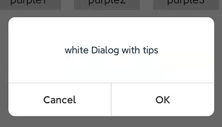

# Directory

- [Directory](#directory)
  - [Introduction](#introduction)
  - [How to use](#how-to-use)
- [Property](#property)
  - [setDialogTheme](#setdialogtheme)
  - [setView](#setview)
  - [setCanceledOnTouchOutside](#setcanceledontouchoutside)
  - [setDialogBackground](#setdialogbackground)
  - [setTitle](#settitle)
  - [setTitleStyle](#settitlestyle)
  - [setContent](#setcontent)
  - [setContentStyle](#setcontentstyle)
  - [setCancel](#setcancel)
  - [setCancelStyle](#setcancelstyle)
  - [setConfirm](#setconfirm)
  - [setConfirmStyle](#setconfirmstyle)
  - [setCancelListener](#setcancellistener)
  - [setConfirmListener](#setconfirmlistener)
  
## Introduction


 

## How to use

```kotlin 
AngryDialog.Builder(this)
    .setDialogTheme("white")
    .setTitle("Tips")
    .setContent("white Dialog with tips")
    .setConfirmListener(View.OnClickListener {
        Log.e("AngryDialog","confirm is onclick")
    })
    .create()
    .show()
```

# Property

## setDialogTheme

可选Theme为：purple,white,red

## setView

## setCanceledOnTouchOutside

## setDialogBackground

## setTitle

## setTitleStyle

## setContent

## setContentStyle

## setCancel

## setCancelStyle

## setConfirm

## setConfirmStyle

## setCancelListener

## setConfirmListener
