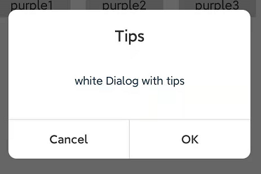
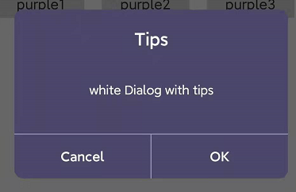
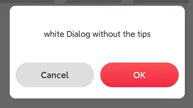

# Directory

- [Directory](#directory)
  - [Introduction](#introduction)
  - [How to use](#how-to-use)
- [Property](#property)
  - [setDialogTheme](#setdialogthemetheme-string)
  - [setView](#setviewviewview)
  - [setCanceledOnTouchOutside](#setcanceledontouchoutsidetouched-boolean)
  - [setDialogBackground](#setdialogbackgroundbackground-int)
  - [setTitle](#settitletext-string)
  - [setTitleStyle](#settitlestyletextcolor-int-textsize-float)
  - [setContent](#setcontenttext-string)
  - [setContentStyle](#setcontentstyletextcolor-int-textsize-float)
  - [setCancel](#setcanceltext-string)
  - [setCancelStyle](#setcancelstyletextcolor-int-textsize-float)
  - [setConfirm](#setconfirmtextstring)
  - [setConfirmStyle](#setconfirmstyletextcolor-int-textsize-float)
  - [setCancelListener](#setcancellistenerlistener-viewonclicklistener--null)
  - [setConfirmListener](#setconfirmlistenerlistener-viewonclicklistener--null)
  
## Introduction

Use AngryDialog’s well-designed dialog, such as: upgrade prompt, select prompt and other prompt methods. It contains many more styles, which helps to adapt to different scenarios.It is very simple to use. Initialize AngryDialog. You can also modify and customize the style of the dialog through existing properties. At the same time, you can also use an existing theme and select the corresponding dialog theme.


## How to use



```kotlin 
AngryDialog.Builder(this)
    .setTitle("Tips")
    .setContent("white Dialog with tips")
    .setConfirmListener(View.OnClickListener {
        Log.e("AngryDialog","confirm is onclick")
    })
    .create()
    .show()
```


```kotlin
AngryDialog.Builder(this)
    .setTitle("Tips")
    .setContent("white Dialog with tips")
    .setConfirm("")
    .create()
    .show()
```



```kotlin
AngryDialog.Builder(this)
    .setTitle("Tips")
    .setDialogBackground(R.drawable.shape_purple_5)
    .setTitleStyle(R.color.white, 20F)
    .setContentStyle(R.color.white, 14F)
    .setCancelStyle(R.color.white, 16F)
    .setConfirmStyle(R.color.white, 16F)
    .setContent("white Dialog with tips")
    .create()
    .show()
```



```kotlin
AngryDialog.Builder(this)
    .setDialogTheme("red")
    .setTitle("Tips")
    .setContent("white Dialog with tips")
    .create()
    .show()
```

# Property

## setDialogTheme(theme: String)

This is to set the theme of the dialog. Select the theme of the dialog by passing in the corresponding String. Default theme: "white", the existing themes:"red"

Example:

```kotlin
.setDialogTheme("red")
```

## setView(view:View)

In the existing properties or themes, you can’t find the style you want, reset the Dialog layout.

Example:

```kotlin
val dialogView = LayoutInflater.from(context).inflate(resource, null)
.setView(dialogView)
```

## setCanceledOnTouchOutside(touched: Boolean)

When enabled, it can control the touch mask outside the dialog to close the dialog.

Example:

```kotlin
.setCanceledOnTouchOutside(true)
```

## setDialogBackground(background: Int)

Redesign the external layout of Dialog, you can pass in color or drawable

Example:

```kotlin
.setDialogBackground(R.drawable.step_white)
```

## setTitle(text: String)

Set the dialog title, if the value of the incoming title is  null or empty, the title will not be displayed

Example:

```kotlin
.setTitle("Tips")
or
.setTitle(R.string.title)
```

## setTitleStyle(textColor: Int, textSize: Float)

Set the style of the title, including: the color of the title font, the size of the title font

Example:

```kotlin
.setTitleStyle(R.color.black,14F)
```

## setContent(text: String)

Set the content, if the value of the set content is empty or null, the content will not be displayed

Example:

```kotlin
.setContent("White Dialog , Hellow World !")
or
.setContent(R.string.content)
```

## setContentStyle(textColor: Int, textSize: Float)

Set the content, if the value of the set content is empty, the content will not be displayed

Example:

```kotlin
.setContentStyle(R.color.black,14F)
```

## setCancel(text: String)

After enabling, you can modify the font of the "OK" button, set it to empty, dialog will not display the button. Default value: confirm

Example:

```kotlin
.setCancel("Cancel")
or
.setCancel(R.string.cancel)
```

## setCancelStyle(textColor: Int, textSize: Float)

Modify the font style of the cancel button, including: font color, font size

Example:

```kotlin
.setCancelStyle(R.color.black,14F)
```

## setConfirm(text:String)

After enabling, you can modify the font of the OK button, set it to empty, dialog will not display the button.Default value: Confirm

Example:

```kotlin
.setConfirm("OK")
or
.setConfirm(R.string.confirm)
```

## setConfirmStyle(textColor: Int, textSize: Float)

Modify the font style of the confirmation button, including: font color, font size

Example:

```kotlin
.setConfirmStyle(R.color.black,14F)
```

## setCancelListener(listener: View.OnClickListener? = null)

Add the listener for the click event of the cancel button, the Dialog will be closed 
by default

Example:

```kotlin
.etCancelListener(View.OnClickListener{

})
```

## setConfirmListener(listener: View.OnClickListener? = null)

Add a listener for the click event of the determined button, the Dialog will be closed by default

Example:

```kotlin
.setConfirmListener(View.OnClickListener{

})
```
