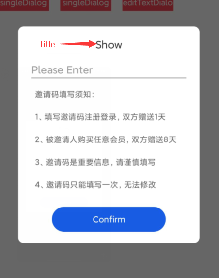

# 目录

- 目录
  - [AlertDialog透明背景](#alertdialog透明背景)
  - [SingleDialog](#SingleDialog)
  - [DoubleDialog](#doubledialog)

## AlertDialog透明背景

将AlertDiaolog的背景色设置成透明色

```kotlin
fun setDialogWindows(dialog: Dialog) {
    val dialogWindow = dialog.window
    dialogWindow?.setBackgroundDrawableResource(R.color.color_transparent) //"#00000000"
    dialogWindow?.setLayout(
        WindowManager.LayoutParams.WRAP_CONTENT,
        WindowManager.LayoutParams.WRAP_CONTENT
    )
}
```

## Dialog By One Button


Xml界面：[dialog_single.xml](/src/res/dialog/dialog_single.xml)

```kotlin
fun showSingleDialog(context: Context, title: String, content: String) {
    val builder = android.app.AlertDialog.Builder(context)
    val view = LayoutInflater.from(context).inflate(R.layout.dialog_single, null)
    val dialogTitle = view.findViewById<TextView>(R.id.dialogTitle)
    val dialogContent = view.findViewById<TextView>(R.id.dialogMainText)
    val dialog = builder.setView(view).create()
    setDialogWindows(dialog)
    dialogTitle.text = title
    dialogContent.text = content
    view.findViewById<TextView>(R.id.dialogConfirm).setOnClickListener {
        dialog.dismiss()
    }
    dialog.setCanceledOnTouchOutside(false) //取消外围触控关闭
    dialog.show()
}
```

## Dialog By Double Button


Xml界面：[dialog_double.xml](../src/res/dialog/dialog_double.xml)

```kotlin
fun showDoubleDialog(context: Context, title: String, content: String, btnConfirm: String, okOnclick: () -> Unit) {
    val builder = android.app.AlertDialog.Builder(context)
    val view = LayoutInflater.from(context).inflate(R.layout.dialog_double, null)
    val dialogTitle = view.findViewById<TextView>(R.id.dialog_double_title)
    val dialogContent = view.findViewById<TextView>(R.id.dialog_double_content)
    val dialogConfirm = view.findViewById<TextView>(R.id.dialog_double_confirm)
    val dialog = builder.setView(view).create()
    setDialogWindows(dialog)
    dialogTitle.text = title
    dialogContent.text = content
    dialogConfirm.text = btnConfirm
    view.findViewById<TextView>(R.id.dialog_double_cancel).setOnClickListener {
        dialog.dismiss()
    }
    dialogConfirm.setOnClickListener {
        dialog.dismiss()
        okOnclick()
    }
    dialog.setCanceledOnTouchOutside(false) //取消外围触控关闭
    dialog.show()
}
```

## Dialog By EditText



Xml页面：[dialog_editText](../src/res/dialog/dialog_editText.xml)

```kotlin
fun showEditTextDialog(context: Context, title: String, setCode: (String, android.app.AlertDialog) -> Unit) {
    val builder = android.app.AlertDialog.Builder(context)
    val view = LayoutInflater.from(context).inflate(R.layout.dialog_editText, null)
    val dialogTitle = view.findViewById<TextView>(R.id.dialog_title)
    val dialogConfirm = view.findViewById<TextView>(R.id.dialog_confirm)
    val dialogEdit = view.findViewById<EditText>(R.id.dialog_edit)
    val dialog = builder.setView(view).create()
    dialogTitle.text = title
    setDialogWindows(dialog)
    dialog.setCanceledOnTouchOutside(true)
    dialog.show()
    dialogConfirm.setOnClickListener {
        if (dialogEdit.text.toString().isEmpty()) {
            Log.d("EditText By Dialog", "EditText must be Empty!")
        } else {
            setCode(dialogEdit.text.toString(), dialog)
        }
    }
}
```
