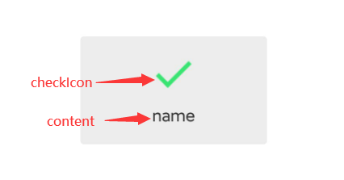

# 目录

- [目录](#目录)
  - [Toast By Icon](#toast-by-icon)

## Toast By Icon



Xml页面：[view_toast](../src/res/toast/view_toast.xml)

```kotlin
fun showNormalToast(context: Context, name: String, checkIcon: Int) {
    val myInflater = LayoutInflater.from(context)
    val view = myInflater.inflate(R.layout.view_toast, null)
    val text = view.findViewById<TextView>(R.id.toastText)
    val icon = view.findViewById<ImageView>(R.id.toastIcon)
    text.text = name
    icon.setImageResource(checkIcon)
    val normalToast = Toast(context)
    normalToast.view = view
    normalToast.setGravity(Gravity.CENTER, 0, 0)
    normalToast.duration = Toast.LENGTH_SHORT
    normalToast.show()
}
```
