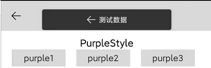
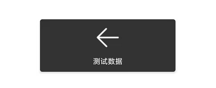

# Directory

- [Directory](#directory)
  - [How to use](#how-to-use)
- [Property](#property)
  - [setView](#setview)
  - [setGravity](#setgravity)
  - [setDuration](#setduration)
  - [setContent](#setcontent)
  - [setContentStyle](#setcontentstyle)
  - [setBackground](#setbackground)
  - [setIcon](#seticon)
  - [setTopIcon](#settopicon)

## How to use

The usage method is also very simple. Through the Builder initialization, you can set up Background, Content, icon and many other styles according to your needs. Here are a few different ways of writing, you can refer to the following examples.


```kotlin
AngryToast.Builder(this)
    .setContent("测试数据")
    .show()
```



```kotlin
AngryToast.Builder(this)
    .setContent("测试数据")
    .setIcon(R.drawable.arrow_back)
    .show()
```



```kotlin
AngryToast.Builder(this)
    .setContent("测试数据")
    .setTopIcon(R.drawable.arrow_back)
    .setGravity(Gravity.CENTER, 0, 0)
    .show()
```

# Property

## setView(view:View)

When the layout needs to be re-adjusted or re-modified, you can customize the View through this property.

Example:

```kotlin
val view = LayoutInflater.from(context).inflate(resource, null)
setView(view)
```

## setGravity(gravity: Int, x: Int, y: Int)

After enabling, you can adjust the display position of the current Toast layout. Default Gravity.Top, optional "Gravity.CENTER", "Gravity.BOTTOM", and the following x and y, x corresponds to horizontal offset, y corresponds to vertical offset.

Example:

```kotlin
setGravity(Gravity.Top,0,0)
```

## setDuration(duration: Int)

After enabling, you can control the display time of Toast, the default Tost.LENGTH_SHORT, optional "Toast.LENGTH_SHORT", "Toasgt.LENGTH_LONG"

Example:

```kotlin
setDuration(Toast.LENGTH_SHORT)
```

## setContent(content:String)

Using this method, you can display the content of Toast, the default is ""
Example:

```kotlin
setContent(”Test Example“)
```

## setContentStyle(textColor: Int, textSize: Float)

Using this method, you can customize the color and size of the Toast content font
Example:

```kotlin
setContentStyle(R.color.black,14F)
```

## setBackground(bg: Int)

After enabling, you can customize the Toast background color

Example:

```kotlin
setBackground(R.drawable.purple)
```

## setIcon(icon:Int)

Using this method, you can add the icon on the left side of the Toast content, the default is "", not displayed

Example:

```kotlin
setIcon(R.drawable.warn)
```

## setTopIcon(icon:Int)

After using this method, add the icon above the Toast content, the default is "", not displayed

Example:

```kotlin
setTopIcon(R.drawable.success)
```
